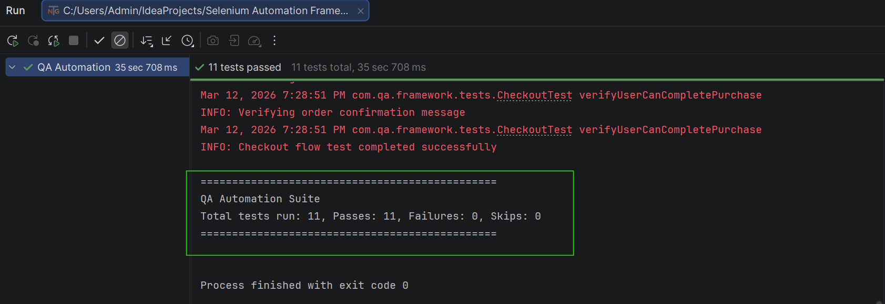
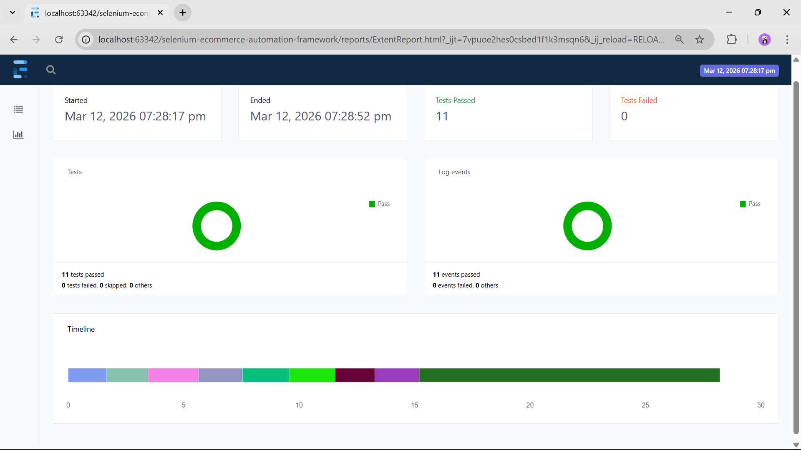

# Selenium E-Commerce Automation Framework

## Project Overview

This project is a **Selenium WebDriver Automation Framework** built using **Java, Maven, and TestNG** following the **Page Object Model (POM)** design pattern.

The framework demonstrates scalable automation practices including reusable utilities, structured test design, logging, reporting, and data-driven testing.

## Tech Stack

* Java
* Selenium WebDriver
* TestNG
* Maven
* Page Object Model (POM)
* Extent Reports
* Log4j Logging

## Framework Features

* BaseTest setup with configuration-driven browser launch
* Page Object Model with method chaining
* Explicit wait utility
* Data-driven testing using TestNG DataProvider
* Logging implementation
* Screenshots on test failure
* Extent Reports for test reporting

## Project Structure

src/main/java

* base
* pages
* utils

src/test/java

* tests

## How to Run Tests

1. Clone the repository
2. Open project in IntelliJ IDEA
3. Run tests using TestNG or Maven

## Sample Test Scenarios

* Valid login test
* Invalid login test
* Access control validation

## Test Execution

## Test Report

## Author

Pragati Nangare
Aspiring QA Automation Engineer
